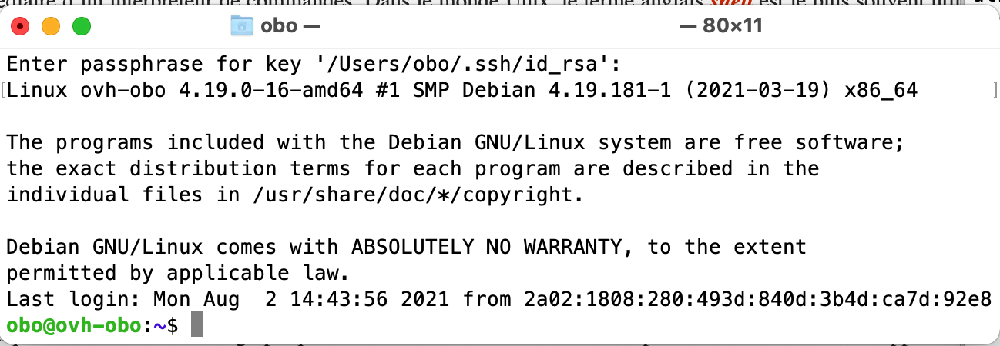
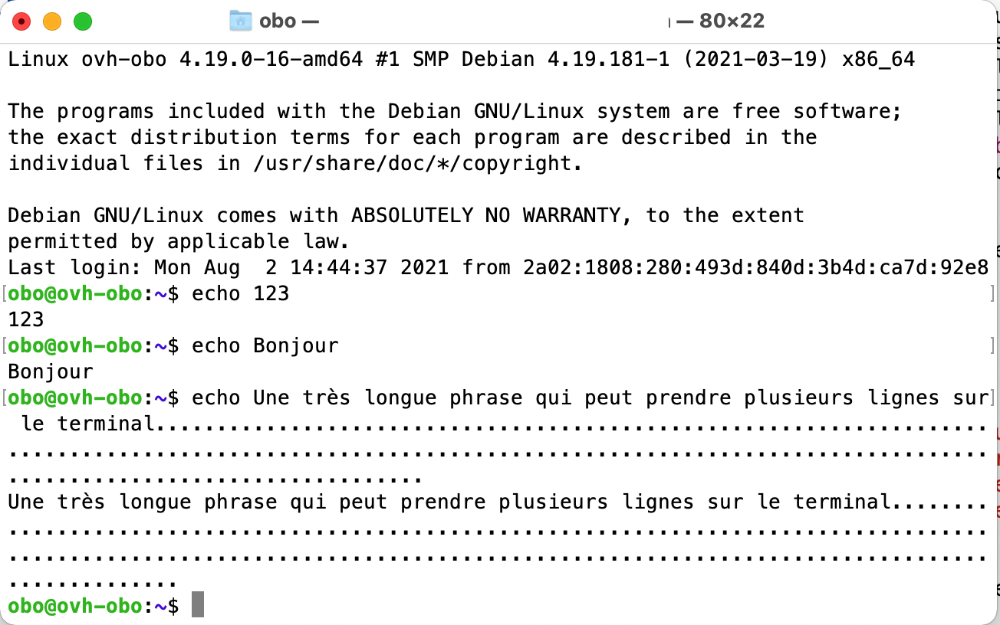

.. -*- coding: utf-8 -*-
.. Copyright |copy| 2012, 2020 by `Olivier Bonaventure <http://perso.uclouvain.be/olivier.bonaventure>`_, Etienne Rivière, Christoph Paasch, Grégory Detal
.. Ce fichier est distribué sous une licence `creative commons <http://creativecommons.org/licenses/by-sa/3.0/>`_

.. _Unix:

Utilisation d'un système Unix
==============================

Dans cette section, nous allons décrire comment utiliser un système Unix tel que GNU/Linux en mettant l'accent sur l'utilisation de la ligne de commande. 

Unix a été conçu à l'époque des mini-ordinateurs. Un mini-ordinateur servait plusieurs utilisateurs en même temps. Ceux-ci y étaient connectés par l'intermédiaire d'un terminal équipé d'un écran et d'un clavier. Les programmes traitaient les données entrées par l'utilisateur via le clavier ou stockées sur le disque. Les résultats de l'exécution de ces programmes étaient affichés à l'écran, sauvegardés sur disque ou parfois imprimés sur papier.

Unix ayant été initialement développé pour manipuler des documents contenant du texte, il comprend de nombreux utilitaires facilitant le traitement de tels fichiers. Chaque utilitaire (nous verrons plus tard ce qu'un utilitaire est précisément, pour l'instant on peut le comprendre comme un programme) Unix a été conçu pour réaliser correctement une fonction principale. Comme nous le verrons ensuite, il est possible de combiner intelligemment ces différents utilitaires pour réaliser des traitements plus complexes pour lesquels il n'existe pas d'utilitaire spécifiques.

Lorsque l'on lance une console ou un terminal, on se retrouve généralement face à une fenêtre qui affiche un message de bienvenue comme dans l'exemple ci-dessous.



Le message de bienvenue peut varier d'un ordinateur à l'autre. Il peut aussi dépendre de l'état du système ou afficher des informations mises en avant par son gestionnaire. Dans l'exemple ci-dessus, il indique que l'on se connecte sur un serveur utilisant Linux version 4.19 (Debian). Il affiche le copyright et les contraintes d'utilisation et indique la date de la dernière connexion. La ligne ``obo@ovh-obo:~$``  est l'endroit où l'on peut taper les différentes commandes.

Syntaxe des commandes et utilisation des *man-pages*
----------------------------------------------------

Une des commandes les plus simples de Unix est `echo(1)`_ qui permet d'afficher de l'information à l'écran (sous format textuel). La capture d'écran ci-dessous présente trois exemples d'utilisation de `echo(1)`_. Comme toutes les commandes Unix, `echo(1)`_ prend un ou plusieurs arguments qui sont ici séparés par des espaces. 

* La première invocation de `echo(1)`_ affiche 123 sur le terminal. 
* La deuxième commande affiche Bonjour. 
* Enfin, la troisième permet d'afficher une très longue phrase qui se termine par une longue suite de points.

.. Note:: 
   Sous Unix, le terminal est aussi appelé la sortie standard, nous y reviendrons bientôt. 



Nous reviendrons sur `echo(1)`_ un peu plus tard car vous verrez que c'est une commande très utile. 
Dans ce syllabus, nous ne présenteront pas les exemples avec une copie d'écran mais sous ce format ci :

.. code:: console 

   $ <commande> 
   <résultat> 
   
Toutes les *commandes* sont dotées d'une syntaxe intuitive présentée ci-dessous.

.. code:: console 

   $ <commande> -[Options courtes [Arguments]] --[Options longues [Arguments]] [Arguments]

* La *Commande* est ce que vous voulez faire.
* Les *Arguments* permettent de choisir sur quoi la commande va agir.
* Les *Options* vous permettent de modifier le comportement de la commande, de manière à pouvoir faire plus de choses. Les options peuvent souvent demander elles aussi un argument.

De plus les options *courtes* peuvent être présentées sous différentes formes, la forme implicite et la forme explicite. La forme implicite consiste à mettre toutes les options sous le même tiret, de cette manière :

.. code:: console

   $ <commande> -[Option1][Options2][...] [Arguments]

Cette forme ne fonctionne que pour les options ne nécéssitant pas d'arguments. La forme explicite quant à elle fonctionne pour les options nécéssitant des arguments et est écrite en spécifiant un seul tiret par option, de cette manière :

.. code:: console 

   $ <commande> -[Option1 [Argument]] -[Option2 [Argument]] [...] [Arguments]

Ceci peut paraître un peu abstrait aux premiers abords mais lorque vous taperez vos premières commandes, vous verrez que ce n'est pas si compliqué. Nous vous invitons à relire ces quelques explications sur la syntaxe vers la fin de la séance, vous verrez que ce sera déjà bien plus clair.

Les commandes Unix telles que `echo(1)`_ ou `cat(1)`_ prennent des arguments comme présentés ci-dessus. Le comportement de ces commandes peut aussi être modifié en spécifiant une ou plusieurs options. Ces options commencent généralement par un ou deux tirets (caractère ``-``). Un premier exemple est le message d'aide succinct que `cat(1)`_ affiche lorsque l'on l'exécute avec ``--help`` comme option. 

.. code:: console

   $ cat --help
   Usage: cat [OPTION]... [FILE]...
   Concatenate FILE(s) to standard output.
   
   With no FILE, or when FILE is -, read standard input.

     -A, --show-all           equivalent to -vET
     -b, --number-nonblank    number nonempty output lines, overrides -n
     -e                       equivalent to -vE
     -E, --show-ends          display $ at end of each line
     -n, --number             number all output lines
     -s, --squeeze-blank      suppress repeated empty output lines
     -t                       equivalent to -vT
     -T, --show-tabs          display TAB characters as ^I
     -u                       (ignored)
     -v, --show-nonprinting   use ^ and M- notation, except for LFD and TAB
     --help     display this help and exit
     --version  output version information and exit

   Examples:
     cat f - g  Output f's contents, then standard input, then g's contents.
     cat        Copy standard input to standard output.

   GNU coreutils online help: <https://www.gnu.org/software/coreutils/>
   Full documentation at: <https://www.gnu.org/software/coreutils/cat>
   or available locally via: info '(coreutils) cat invocation'


La quasi totalité des commandes Unix affichent un message d'aide de ce type lorsqu'elles sont appelées avec ``--help`` ou parfois ``-h`` comme option.   
 
.. topic:: Pages de manuel
   
   Chaque commande possède sa *Man-page* (ou *Page de manuel* en français) expliquant ce que fait la commande, comment l'utiliser et quelles sont ses options. 
   L'accès à une page de manuel se fait via la commande `man(1)`_ avec comme argument le nom de la commande concernée. La commande `man(1)`_ supporte plusieurs paramètres qui sont décrits dans sa page de manuel accessible via ``man man``.  

   Vous pourrez remarquer que les commandes sont écrites avec un nombre de 1 à 8 à leur côté (par exemple : `echo(1)`_). Ce nombre correspond à la section à laquelle appartient la page de manuel. Dans ce syllabus nous aborderons uniquement les commandes de la première section, correspondant aux utilitaires disponibles aux utilisateurs.   

   Outre les pages de manuel accessibles via `man(1)`_, il existe également de nombreux sites web où l'on peut accéder aux pages de manuels de différentes versions de Unix dont notamment :
   
   - les pages de manuel de `Debian GNU/Linux <http://manpages.debian.net/>`_
   - les pages de manuel de `FreeBSD <http://www.freebsd.org/cgi/man.cgi>`_
   - les pages de manuel de `MacOS <http://developer.apple.com/documentation/Darwin/Reference/ManPages/index.html>`_
   
  Les man-pages sont une source d'informations très importantes lors de l'utilisation d'un système Unix. Il ne faut surtout pas hésiter à les utiliser.


  Dans la version en-ligne de ces notes, toutes les références vers un programme Unix, un appel système ou une fonction de la librairie pointent vers la page de manuel Linux correspondante. Les pages de manuel sont également disponibles sur de nombreux sites web, comme par exemple `https://www.man7.org/linux/man-pages/index.html <https://www.man7.org/linux/man-pages/index.html>`_ qui présente les dernières versions des pages de manuel de Linux en anglais. Certaines de ces pages de manuel ont étés traduite (parfois partiellement en français). Vous les trouverez notamment sur `https://man.cx/ <https://man.cx/>`_.

.. todo? ajouter un petit qcm demandant ce que sont les man-page, qu'est ce qu'une commande, etc ?

Navigation dans un arbre de fichiers Unix
-----------------------------------------

En pratique, un ordinateur contient souvent des milliers de fichiers. Les deux fichiers que nous allons utiliser dans les sections suivantes -``fichier.txt`` et ``points.csv``- sont dans un répertoire. Un répertoire est une structure logique qui regroupe des fichiers et/ou d'autres répertoires. On peut imaginer le disque dur ou le SSD d'un ordinateur comme étant une grand armoire remplie de tiroirs. Chaque tiroir est un répertoire qui peut contenir des fichiers ou d'autres répertoires.


Dans cette section, nous allons aborder les commandes de gestions de fichiers. Nous allons expliquer comment se déplacer dans les répertoires, mais aussi comment en créer ou encore en supprimer.


La commande ``ls`` 
^^^^^^^^^^^^^^^^^^

La commande `ls(1)`_ (pour `list`) est une commande fondamentale lorsqu'il s'agit de se déplacer dans les répertoires de l'ordinateur. Celle-ci permet de lister les fichiers et répertoires qui se trouvent dans le répertoire courant par défaut ou dans un quelconque répertoire dont le nom est passé en argument. Ceci est particulièrement intéressant lorsque vous n'avez pas accès à une interface graphique, car c'est le seul moyen que vous aurez de connaître le contenu du système rapidement. 

.. code:: console
   
   $ ls
   fichier.txt  points.csv
   
L'exemple ci-dessus montre les deux fichiers nommés ``fichier.txt`` et ``points.csv``, se trouvant tous deux dans le répertoire courant. Le répertoire courant est le répertoire dans lequel les commandes que vous tapez vont s'exécuter. 

La commande `ls(1)`_ supporte un grand nombre d'options. En voici quelques unes qui sont assez utiles en pratique. Les autres sont décrites dans la page de manuel de `ls(1)`_. L'option ``-l`` affiche des informations complémentaires sur chaque fichier comme le nom de son propriétaire, le groupe auquel celui-ci appartient, la date de dernière modification, la taille et les permissions du fichier.

.. code:: console

   $ ls -l
   total 8 -> taille totale du répertoire
   -rw-r--r--            1             obo         obo         283      Aug    2       15:34   fichier.txt
   -rw-r--r--            1             obo         obo         181      Aug    3       10:18   points.csv
        ^                ^              ^           ^           ^        ^     ^         ^         ^
        |                |              |           |           |        |     |         |         |
   Permissions   nombre de liens   Propriétaire  groupe  taille (bytes) Mois  jour  heure/année    Nom

La première ligne indique l'espace disque occupé par les fichiers du répertoire (dans ce cas, 8 KBytes). Ensuite, pour chaque fichier on trouve ses permissions, son propriétaire et le groupe auquel il appartient, la date de dernière modification et le nom du fichier. Il y a là dedans de nombreuses informations utiles, dont certaines d'entre elles ne seront pas vue dans ce cours d'introduction.

Il est possible de modifier l'ordre dans lequel `ls(1)`_ affiche les différents fichiers d'un répertoire. Ainsi, l'option ``-S`` permet de les afficher par ordre décroissant de taille, bien pratique lorsqu'il faut rechercher les gros fichiers qui occupent de la place sur le disque due. L'option ``-t`` permet d'afficher d'abord les fichiers les plus récents. Très pratique pour retrouver le dernier fichier téléchargé par exemple.

Structure d'un arbre de fichier Unix
^^^^^^^^^^^^^^^^^^^^^^^^^^^^^^^^^^^^

La racine (correspondant au répertoire ``/``) contient différents sous-répertoires dont la plupart sont nécessaires au bon fonctionnement du système. 
 
.. code:: console

   $ ls /
   bin   home            lib32       media  root  sys  vmlinuz
   boot  initrd.img      lib64       mnt    run   tmp  vmlinuz.old
   dev   initrd.img.old  libx32      opt    sbin  usr
   etc   lib             lost+found  proc   srv   var	  
	
Les trois répertoires qui nous intéresseront le plus sont ``/home`` qui contient un répertoire appartenant à chaque utilisateur. C'est dans ce répertoire qu'un utilisateur pourra stocker ses fichiers privés. Le répertoire ``/media`` est celui dans lequel des dispositifs externes tels que des clés USB seront accessibles. Enfin, le répertoire ``/tmp`` contient des fichiers temporaires qui sont automatiquement effacés à chaque arrêt de l'ordinateur.


Il est aussi possible de préciser plus finement les lignes que l'on veut extraire d'un fichier texte avec `grep(1)`_. Cela se fait en donnant comme argument à `grep(1)`_ une `expression régulière` au lieu d'une simple chaîne de caractères. A titre d'exemple, le caractère ``^`` dans une expression régulière indique qu'il faut rechercher le mot qui la suit en début de ligne. Le caractère ``$`` indique qu'il faut rechercher le mot qui le précède uniquement en fin de ligne.


   Sous Unix, il y a deux manières différentes de donner des chemins d'accès aux fichiers : les chemins *relatifs* et les chemins *absolus*.

   #. Les chemins relatifs sont donnés par rapport au répertoire courant : ``./path/from/current/directory``
   #. Les chemins absolus sont donnés par rapport à la racine : ``/path/from/root``
   
   Les chemins relatifs permettent d'aller plus rapidement (les chemins d'accès sont moins longs) mais ne permettent pas d'atteindre les fichiers parents facilement, ce que permet par contre le chemin absolu.

Commandes de création de fichiers et répertoires 
^^^^^^^^^^^^^^^^^^^^^^^^^^^^^^^^^^^^^^^^^^^^^^^^

Une commande intéressante de manipulation des fichiers est `touch(1)`_. Elle permet de créer un fichier qui n'existe pas ou de mettre à jour la date de modification d'un fichier existant sans changer son contenu.

.. code:: console

   $ ls -lt
   total 8
   -rw-r--r-- 1 obo obo 181 Aug  3 10:18 points.csv
   -rw-r--r-- 1 obo obo 283 Aug  2 15:34 fichier.txt
   $ touch fichier.txt 
   $ ls -lt
   total 8
   -rw-r--r-- 1 obo obo 283 Aug  3 14:11 fichier.txt
   -rw-r--r-- 1 obo obo 181 Aug  3 10:18 points.csv
   $ touch vide.txt 
   $ ls -lt 
   total 8
   -rw-r--r-- 1 obo obo   0 Aug  3 14:13 vide.txt
   -rw-r--r-- 1 obo obo 283 Aug  3 14:11 fichier.txt
   -rw-r--r-- 1 obo obo 181 Aug  3 10:18 points.csv
   

Pour organiser tous ces fichiers (nous en avons déjà 3 !), il est important de pouvoir les regrouper dans des répertoires. Prenons l'exemple d'une étudiante bien organisée qui doit gérer toutes les informations relatives à chacun de ses cours. Elle va créer un répertoire pour chaque année académique et un sous-répertoire pour chaque cours. La commande `mkdir(1)`_ (pour *make-directory*) lui permet de créer un répertoire pour l'année ``2021-2022``. 

.. code:: console

   $ mkdir 2021-2022/
   $ ls -l
   total 12
   drwxr-xr-x 2 obo obo 4096 Aug  3 16:10 2021-2022
   -rw-r--r-- 1 obo obo  283 Aug  3 14:11 fichier.txt
   -rw-r--r-- 1 obo obo  181 Aug  3 10:18 points.csv
   -rw-r--r-- 1 obo obo    0 Aug  3 14:13 vide.txt

Elle va ensuite y créer les répertoires des cours d'informatiques, d'anglais et de mathématiques. Pour cela, elle devra aller dans le répertoire ``2021-2022`` en utilisant la commande `cd(1posix)`_. 

.. code:: console 

   $ cd 2021-2022/
   ~/2021-2022$ ls -l
   total 0
   ~/2021-2022$ mkdir anglais
   ~/2021-2022$ mkdir info
   ~/2021-2022$ mkdir math
   ~/2021-2022$ ls -l
   total 12
   drwxr-xr-x 2 obo obo 4096 Aug  3 16:18 anglais
   drwxr-xr-x 2 obo obo 4096 Aug  3 16:18 info
   drwxr-xr-x 2 obo obo 4096 Aug  3 16:18 math
   ~/2021-2022$ pwd 
   home/obo/2021-2022

Ci-dessus on peut observer que la commande `cd(1posix)`_ (pour *change-directory*) permet de descendre l'arborescence des fichiers, depuis la racine vers les répertoires feuille (un répertoire feuille est un répertoire n'ayant pas de sous-répertoire). Tandis que la commande `pwd(1)`_ (pour *print-working-directory*) permet d'afficher à l'écran le répertoire courant. 

Comment faire pour remonter l'arborescence des fichiers vers la racine ? Pour cela, Unix utilise deux sous-répertoires *cachés* qui sont présents dans tous les répertoires : 

* Le sous-répertoire ``.`` est un synonyme du répertoire courant. Il est peu utilisé. 
* Le sous-répertoire ``..`` est un `lien` vers le répertoire père du répertoire courant. En utilisant le répertoire ``..`` il est donc possible de remonter vers le répertoire racine. 

L'exercice suivant va vous permettre de tester vos connaissances sur les commandes de bases de navigation (n'hésitez surtout pas à consulter les pages de manuel) :

.. inginious:: ls-cd-mcq

Ceux-ci vous apprendront à créer des répertoires :

.. inginious:: mkdir-base

.. inginious:: mkdir-pratique


Plus sur la commande ``ls``
^^^^^^^^^^^^^^^^^^^^^^^^^^^

Vous avez déjà pu voir à quoi servait l'option ``-l`` de `ls(1)`_, mais il existe bien d'autres options ! Nous allons maintenant jeter un oeil aux options ``-a`` et ``R``. En regardant cet exemple, essayez de déterminer à quoi sert l'option ``-a`` :

.. code:: console

   ~/2021-2022/math$ ls -l
   total 0
   ~/2021-2022/math$ ls -la
   total 8
   drwxr-xr-x 2 obo obo 4096 Aug  3 16:18 .
   drwxr-xr-x 5 obo obo 4096 Aug  3 16:18 ..
   ~/2021-2022/math$ cd ..
   ~/2021-2022$ ls -la
   total 20
   drwxr-xr-x 5 obo obo 4096 Aug  3 16:18 .
   drwxr-xr-x 3 obo obo 4096 Aug  3 16:10 ..
   drwxr-xr-x 2 obo obo 4096 Aug  3 16:18 anglais
   drwxr-xr-x 2 obo obo 4096 Aug  3 16:18 info
   drwxr-xr-x 2 obo obo 4096 Aug  3 16:18 math
   ~/2021-2022$ cd ..
   ~$ ls -la
   total 20
   drwxr-xr-x  3 obo obo 4096 Aug  3 16:10 .
   drwxr-xr-x 14 obo obo 4096 Aug  3 14:04 ..
   drwxr-xr-x  5 obo obo 4096 Aug  3 16:18 2021-2022
   -rw-r--r--  1 obo obo  283 Aug  3 14:11 fichier.txt
   -rw-r--r--  1 obo obo  181 Aug  3 10:18 points.csv
   -rw-r--r--  1 obo obo    0 Aug  3 14:13 vide.txt

Si vous ne trouvez pas avec cet exemple, voici un petit tips : l'options ``-a`` signifie *all*. Si cela ne vous a pas aidé et que vous ne l'avez pas encore fait, aller regarder dans la page de manuel de `ls(1)`_ !

L'option ``-R`` de la commande `ls(1)`_ permet quant à elle de parcourir automatiquement tous les sous-répertoires (et leurs sous-répertoires). N'utilisez pas cette option sur des fichiers dont vous ne connaissez pas la taille ou la profondeur, par exemple, utiliser cette option sur la racine du système (nous expliquons ce que cela signifie ci-dessous) va permettre de lister TOUS les fichiers de votre ordinateur, ce qui pourrait prendre du temps.

.. code:: console

   ~$ ls -lRa
   .:
   total 20
   drwxr-xr-x  3 obo obo 4096 Aug  3 16:10 .
   drwxr-xr-x 14 obo obo 4096 Aug  3 14:04 ..
   drwxr-xr-x  5 obo obo 4096 Aug  3 16:18 2021-2022
   -rw-r--r--  1 obo obo  283 Aug  3 14:11 fichier.txt
   -rw-r--r--  1 obo obo  181 Aug  3 10:18 points.csv
   -rw-r--r--  1 obo obo    0 Aug  3 14:13 vide.txt

   ./2021-2022:
   total 20
   drwxr-xr-x 5 obo obo 4096 Aug  3 16:18 .
   drwxr-xr-x 3 obo obo 4096 Aug  3 16:10 ..
   drwxr-xr-x 2 obo obo 4096 Aug  3 16:18 anglais
   drwxr-xr-x 2 obo obo 4096 Aug  3 16:18 info
   drwxr-xr-x 2 obo obo 4096 Aug  3 16:18 math
   
   ./2021-2022/anglais:
   total 8
   drwxr-xr-x 2 obo obo 4096 Aug  3 16:18 .
   drwxr-xr-x 5 obo obo 4096 Aug  3 16:18 ..
   
   ./2021-2022/info:
   total 8
   drwxr-xr-x 2 obo obo 4096 Aug  3 16:18 .
   drwxr-xr-x 5 obo obo 4096 Aug  3 16:18 ..
   
   ./2021-2022/math:
   total 8
   drwxr-xr-x 2 obo obo 4096 Aug  3 16:18 .
   drwxr-xr-x 5 obo obo 4096 Aug  3 16:18 ..

Cet exercice vous permettra de vous familiariser avec l'utilisation pratique de `ls(1)`_

.. inginious:: ls-base

Commandes de déplacement de fichiers
^^^^^^^^^^^^^^^^^^^^^^^^^^^^^^^^^^^^

Maintenant que vous savez comment vous retrouver dans un arbre de fichier, nous pouvons commencer à *manipuler* celui-ci, c'est à dire déplacer/créer des fichiers et/ou des répertoires.

La commande `cp(1)`_ (pour *copy*) permet de copier un fichier sous un autre nom ou de le copier dans un autre répertoire en conservant son nom original. On peut par exemple faire un backup d'un fichier avant de le modifier afin de pouvoir récupérer son état original en cas de problème.

.. code:: console

   $ cp fichier.txt fichier.txt.bak
   $ ls -l
   total 16
   drwxr-xr-x 5 obo obo 4096 Aug  3 16:18 2021-2022
   -rw-r--r-- 1 obo obo  283 Aug  3 14:11 fichier.txt
   -rw-r--r-- 1 obo obo  283 Aug  3 16:52 fichier.txt.bak
   -rw-r--r-- 1 obo obo  181 Aug  3 10:18 points.csv
   -rw-r--r-- 1 obo obo    0 Aug  3 14:13 vide.txt
   $ cp fichier.txt 2021-2022/info/
   $ ls -l 2021-2022/info/
   total 4
   -rw-r--r-- 1 obo obo 283 Aug  3 16:52 fichier.txt

La commande `mv(1)`_ permet quant à elle de renommer un fichier ou de le déplacer dans un autre répertoire.

.. code:: console

   $ mv vide.txt a_effacer.txt
   $ mkdir backup
   $ mv fichier.txt.bak backup/
   $ ls -l
   total 16
   drwxr-xr-x 5 obo obo 4096 Aug  3 16:18 2021-2022
   -rw-r--r-- 1 obo obo    0 Aug  3 14:13 a_effacer.txt
   drwxr-xr-x 2 obo obo 4096 Aug  3 16:55 backup
   -rw-r--r-- 1 obo obo  283 Aug  3 14:11 fichier.txt
   -rw-r--r-- 1 obo obo  181 Aug  3 10:18 points.csv
   $ ls -l backup/
   total 4
   -rw-r--r-- 1 obo obo 283 Aug  3 16:52 fichier.txt.bak

.. Note:: 
   
   Pour être plus efficace et être capable de sélectionner plusieurs fichiers en même temps, il existe ce que l'on appelle des caractères *wildcards*. Ces caractères servent en fait de jokers, ils peuvent prendre la place d'un ou plusieurs autres caractères.

   Par exemple, si vous souhaitez déplacer tous les fichiers commençant par les caractères "test" dans le répertoire ``destination``. Disons ``test-python.py``, ``test-c.c`` et ``test-text.txt``. Il vous suffirait de taper la commande :

   .. code:: console

      $ mv test* destination

   Pour être plus précis, il existe 2 wildcards très souvent utilisés : ``?`` et ``*`` utilisable dans de nombreuses commandes.

   #. Le joker "unique" : ``?`` ne permet de remplacer qu'un seul caractère.
   #. Le joker "multiple" : ``*`` permet de remplacer quand à lui plusieurs caractères.

   Il existe d'autres caractères spéciaux, vous trouverez plus de détails dans les pages de manuels.

.. inginious:: mv-pratique
   
Commandes de suppression de fichiers/répertoires
^^^^^^^^^^^^^^^^^^^^^^^^^^^^^^^^^^^^^^^^^^^^^^^^

Parfois il est nécessaire de supprimer des fichiers ou des répertoires. Cela peut se faire un utilisant les commandes `rm(1)`_ (pour *remove*) et `rmdir(1)`_ (pour *remove-directory*). Il faut noter que `rmdir(1)`_ ne peut effacer qu'un sous répertoire vide. Vous devez donc d'abord effacer les fichiers qui se trouvent dans un sous-répertoire avant de pouvoir l'effacer lui-même.

.. code:: console

   $ rm a_effacer.txt 
   $ ls -l
   total 16
   drwxr-xr-x 5 obo obo 4096 Aug  3 16:18 2021-2022
   drwxr-xr-x 2 obo obo 4096 Aug  3 16:55 backup
   -rw-r--r-- 1 obo obo  283 Aug  3 14:11 fichier.txt
   -rw-r--r-- 1 obo obo  181 Aug  3 10:18 points.csv
   $ rmdir backup/
   rmdir: failed to remove 'backup/': Directory not empty
   $ cd backup/
   $ rm fichier.txt.bak 
   backup$ cd ..
   $ rmdir backup/
   
.. inginious:: rm-qcm

.. inginious:: rm-base 


Traitements de fichiers
-----------------------

Observer le contenu d'un fichier 
^^^^^^^^^^^^^^^^^^^^^^^^^^^^^^^^

Imaginons que le fichier ``fichier.txt`` à notre disposition contient le texte suivant :

.. code:: console 

   Les sanglots longs
   Des violons
   De l’automne
   Blessent mon coeur
   D’une langueur
   Monotone.

   Tout suffocant
   Et blême, quand
   Sonne l’heure,
   Je me souviens
   Des jours anciens
   Et je pleure;

   Et je m’en vais
   Au vent mauvais
   Qui m’emporte
   Deçà, delà,
   Pareil à la
   Feuille morte.

Une des premières commandes que l'on utilise pour manipuler des fichiers textes est la commande `cat(1)`_. Celle-ci affiche simplement sur le terminal le contenu du fichier passé en argument. Dans l'exemple ci-dessous, Unix exécute la commande `cat(1)`_ avec comme argument le nom ``fichier.txt``. Lors de son exécution, la commande `cat(1)`_ ouvre le fichier dont le nom est ``fichier.txt`` et affiche son contenu.

.. code:: console

   $ cat fichier.txt 
   Les sanglots longs
   Des violons
   De l’automne
   Blessent mon coeur
   D’une langueur
   Monotone.

   Tout suffocant
   Et blême, quand
   Sonne l’heure,
   Je me souviens
   Des jours anciens
   Et je pleure;

   Et je m’en vais
   Au vent mauvais
   Qui m’emporte
   Deçà, delà,
   Pareil à la
   Feuille morte.

.. inginious:: ccm-cat

.. inginious:: cat-base 

.. note:: Raccourcis clavier

   La ligne de commande supporte de nombreux raccourcis clavier qui peuvent vous permettre d'être encore plus rapide. La flèche vers le haut vous permet par exemple de récupérer les commandes précédentes. Vous pouvez ensuite utiliser les flèches gauche et droite pour éditer l'ancienne commande avant de taper sur Return pour l'exécuter. Lorsque vous tapez les premières lettres d'une commande, il suffit de taper sur la touche de tabulation pour que la commande soit complétée si elle est reconnue. Ainsi, si vous tapez ``mkd`` suivi de tabulation, les caractères ``ir`` manquants seront automatiquement ajouté. Ce mécanisme de complétion de la ligne de commande s'applique aussi aux arguments lorsque ceux-ci sont des fichiers ou des répertoires. Ainsi, si vous tapez ``cat fi`` suivi de tabulation dans le répertoire, la commande se complétera en ``cat fichier.txt``.

Il y a trois commandes qui sont très proches de `cat(1)`_ et qui peuvent être utiles lorsque l'on doit consulter de longs fichiers texte. Tout d'abord, la commande `head(1)`_ permet de consulter le début d'un fichier. Sans option, `head(1)`_ affiche les dix premières lignes du fichier. Avec l'option ``-n`` suivie d'un entier (``x``), `head(1)`_ affiche les ``x`` premières lignes du fichier (voir exemple ci-dessous). La commande `tail(1)`_ fait la même chose pour la fin du fichier. Si vous consultez la page de manuel de `tail(1)`_, vous verrez qu'elle a beaucoup plus d'options que `head(1)`_. Il y a en effet plusieurs cas pratiques dans lesquels il est utile de lire la fin d'un fichier que son début, mais ceux-ci sortent du cadre de cette brève introduction à la ligne de commande.

.. code:: console

   $head -n 4 fichier.txt 
   Les sanglots longs
   Des violons
   De l’automne
   Blessent mon coeur
   $ tail --lines 3 fichier.txt 
   Deçà, delà,
   Pareil à la
   Feuille morte.

.. inginious:: head-base

La commande `more(1)`_ permet de visualiser tout un long fichier "page par page". Elle afiche la première page du fichier et invite l'utilisateur à taper un caractère pour poursuivre l'affichage du fichier. Si vous tapez sur espace, `more(1)`_ avancera d'un écran. Si vous tapez sur le retour à la ligne, `more(1)`_ avancera d'une ligne. Si vous tapez sur ``/``, vous pouvez indiquer un mot à rechercher dans le fichier (*Vim-search*). `more(1)`_ lira le fichier jusqu'à trouver le mot que vous recherchez et l'affichera. Enfin en tapant ``h``, `more(1)`_ vous affichera une page d'aide précisant toutes les touches que vous pouvez presser durant l'exécution de `more(1)`_ et le rôle de chacune d'entre elles.
   
Obtenir des informations sur le fichier ou son contenu
^^^^^^^^^^^^^^^^^^^^^^^^^^^^^^^^^^^^^^^^^^^^^^^^^^^^^^

Plusieurs commandes permettent de faire des manipulations plus avancées sur les fichiers. `wc(1)`_ (pour *word-count*) permet d'extraire différents compteurs (nombre de lignes, nombre de mots et nombre de caractères) d'un fichier texte.

.. code:: console

   $ wc -w fichier.txt 
   45 fichier.txt
   $ wc -m fichier.txt 
   268 fichier.txt
   $ wc -l fichier.txt 
   20 fichier.txt
   $ wc fichier.txt 
   20  45 283 fichier.txt

Avec l'option ``-w``, `wc(1)`_ affiche le nombre de mots tandis qu'avec l'option ``-m``, `wc(1)`_ affiche le nombre de caractères. Enfin, l'option ``-l`` permet de connaître le nombre de lignes du fichier. Sans option, `wc(1)`_ affiche le nombre de lignes, le nombre de mots et le nombre de caractères.

Une autre commande très utile est `grep(1)`_. Elle permet notamment d'extraire d'un fichier texte les lignes qui contiennent ou ne contiennent pas une chaîne de caractères passée en argument. `grep(1)`_ est très souvent utilisé pour extraire de l'information de fichiers texte. La façon la plus simple d'utiliser `grep(1)`_ est d'utiliser comme argument la chaine de caractères à rechercher suivi du nom du fichier.

.. code:: console

   $ grep je fichier.txt 
   Et je pleure;
   Et je m’en vais

`grep(1)`_ est une des commandes les plus puissantes de Unix. Nous n'aurons pas l'occasion de la présenter complètement. Elle supporte de nombreuses options comme par exemple ``-i`` (pour *ignore-case*) qui considère les majuscules et minuscules comme équivalentes.

.. code:: console
          
   $ grep -i jE fichier.txt 
   Je me souviens
   Et je pleure;
   Et je m’en vais

Deux autres options peuvent être intéressantes. L'option ``-v`` (pour *invert*) demande à `grep(1)`_ d'afficher les lignes qui ne contiennent pas la chaîne de caractères passée en argument. L'option ``-c`` (pour *count*) compte les lignes qui correspondent plutôt que de les afficher. Les options peuvent être combinées comme dans les exemples ci-dessous.

.. code:: console

   $ grep -v e fichier.txt 
   
   Tout suffocant
   
   $ grep -c je fichier.txt 
   2
   $ grep -ci je fichier.txt 
   3
   $ grep -c -i je fichier.txt 
   3

Il est aussi possible de préciser plus finement les lignes que l'on veut extraire d'un fichier texte avec `grep(1)`_. Cela se fait en donnant comme argument à `grep(1)`_ une `expression régulière` (aussi appelée *re* ou *regex*) au lieu d'une simple chaîne de caractères. A titre d'exemple dans une expression régulière, le caractère ``"^"`` indique qu'il faut rechercher le mot en début de ligne alors que le caractère ``"$"`` indique qu'il faut rechercher le mot uniquement en fin de ligne.

.. code:: console

   $ grep -e "r$" fichier.txt 
   Blessent mon coeur
   D’une langueur
   $ grep -e "^Et" fichier.txt 
   Et blême, quand
   Et je pleure;
   Et je m’en vais

.. inginious:: grep-base 

Pour présenter les dernières commandes, nous allons utiliser notre second fichier ``points.csv``. Celui-ci est au format ``comma-separated values``, c'est-à-dire qu'il contient des mots et des valeurs qui sont séparées par une virgule. La plupart des tableurs permettent de manipuler de tels fichiers, tout comme les commandes Unix que nous allons le voir. 

.. code:: console

   $ cat points.csv 
   Jean, Dubois, 12, 17
   Julie, Durant, 19, 16
   Marc, Michel, 11, 16
   Antoine, Marchand, 15, 15
   Emilie, Michel, 17, 19
   Laurence, Dupont, 14, 18
   Vanessa, Dupond, 14, 12
   Simon, Sanzot, 8, 9

Une première commande intéressante pour manipuler de tels fichiers est la commande `sort(1)`_. Comme son nom l'indique, celle-ci permet de trier des fichiers texte dans une ordre particulier. Sans option, `sort(1)`_ trie les lignes dans l'ordre alphabétique.

.. code:: console

   $ sort points.csv
   Antoine, Marchand, 15, 15
   Emilie, Michel, 17, 19
   Jean, Dubois, 12, 17
   Julie, Durant, 19, 16
   Laurence, Dupont, 14, 18
   Marc, Michel, 11, 16
   Simon, Sanzot, 8, 9
   Vanessa, Dupond, 14, 12


`sort(1)`_ a trié les étudiants sur base de leur prénom. L'option ``-r`` permet d'avoir les lignes dans l'ordre alphabétique inverse. Pour pouvoir trier sur base du nom de famille ou des points obtenus, il suffit d'indiquer à `sort(1)`_ la structure du fichier. Dans un fichier ``csv``, les champs sont séparés par une virgule. Par convention, le premier champ dans chaque ligne est le champ ``1``, le second le ``2``, ... L'option ``-t`` permet d'indiquer le séparateur des champs et l'option ``-k`` le numéro du champ à utiliser pour le tri. 

.. code:: console

   $ sort -t "," -k 1 points.csv
   Antoine, Marchand, 15, 15
   Emilie, Michel, 17, 19
   Jean, Dubois, 12, 17
   Julie, Durant, 19, 16
   Laurence, Dupont, 14, 18
   Marc, Michel, 11, 16
   Simon, Sanzot, 8, 9
   Vanessa, Dupond, 14, 12
 
On peut maintenant trier ce fichier sur base des noms de familles :

.. code:: console

   $ sort -t "," -k 2 points.csv
   Jean, Dubois, 12, 17
   Vanessa, Dupond, 14, 12
   Laurence, Dupont, 14, 18
   Julie, Durant, 19, 16
   Antoine, Marchand, 15, 15
   Marc, Michel, 11, 16
   Emilie, Michel, 17, 19
   Simon, Sanzot, 18, 10

Un autre exemple pourrait être de trier sur base des points obtenus (remarquez l'utilisation de l'option ``-r``, à votre avis quelle est son utilité ?):

.. code:: console

   $sort -r -t "," -k 4 points.csv
   Simon, Sanzot, 8, 9
   Emilie, Michel, 17, 19
   Laurence, Dupont, 14, 18
   Jean, Dubois, 12, 17
   Marc, Michel, 11, 16
   Julie, Durant, 19, 16
   Antoine, Marchand, 15, 15
   Vanessa, Dupond, 14, 12


Malheureusement, ce dernier tri ne donne pas le résultat attendu. On voudrait avoir en première ligne l'étudiant ou l'étudiante qui a le mieux réussi le cours. Or, ce n'est pas ce que la commande `sort(1)`_ affiche. C'est parce que la commande `sort(1)`_ fait un tri par ordre alphabétique par défaut. Pour obtenir un tri qui prend en compte les nombres (entiers ou réels), il faut utiliser l'option ``-g``.    


Parfois, il est nécessaire d'extraire certains champs d'un fichier en format ``csv``. La commande `cut(1)`_ peut être très utile dans ce cas. Elle supporte plusieurs options. L'option ``-d`` permet d'indiquer le séparateur entre les différents champs du fichier. L'option ``-f`` est suivie de la liste des champs qu'il faut extraire du fichier.

.. code:: console
          
   $ cut -d "," -f 1,3 points.csv
   Jean, 12
   Julie, 19
   Marc, 11
   Antoine, 15
   Emilie, 17
   Laurence, 14
   Vanessa, 14
   Simon, 8

Notre dernier exemple est la commande `uniq(1)`_ qui permet de retirer d'un fichier *trié* les lignes qui sont identiques. A titre d'exemple, considérons le nouveau fichier ``noms.txt`` qui contient tous les noms de famille du fichier ``points.csv`` en ordre alphabétique.

.. code:: console

   $ cat noms.txt 
   Dubois
   Dupond
   Dupont
   Durant
   Marchand
   Michel
   Michel
   Sanzot

   
La commande `uniq(1)`_ permet de retirer toutes les lignes qui sont identiques dans ce fichier *trié*.

.. code:: console

   $ uniq noms.txt 
   Dubois
   Dupond
   Dupont
   Durant
   Marchand
   Michel
   Sanzot

.. inginious:: qcm-sort
   
Combiner des commandes
^^^^^^^^^^^^^^^^^^^^^^

La plupart des utilitaires fournis avec un système Unix ont été conçus pour être utilisés en combinaison avec d'autres. Cette combinaison efficace de plusieurs petits utilitaires est un des points forts des systèmes Unix par rapport à d'autres systèmes d'exploitation. On peut imaginer par exemple associer `sort(1)`_ et `head(1)`_ pour n'afficher que les premiers noms en ordre alphabétique d'une liste d'étudiants disponible initialement sous forme non triée. Afin de permettre cette combinaison, chaque programme Unix en cours d'exécution (appelé un *processus*) est associé à trois *flux* standards :

 - une entrée standard (:term:`stdin` en anglais) qui est un flux d'informations par lequel le processus reçoit les données à traiter. Par défaut, l'entrée standard est associée au clavier.
 - une sortie standard (:term:`stdout` en anglais) qui est un flux d'informations sur lequel le processus écrit le résultat de son traitement. Par défaut, la sortie standard est associée au terminal.
 - une sortie d'erreur standard (:term:`stderr` en anglais) qui est un flux de données sur lequel le processus écrira les messages d'erreur éventuels. Par défaut, la sortie d'erreur standard est associée au même terminal que :term:`stdout`.

La puissance du :term:`shell` vient de la possibilité de combiner des commandes en redirigeant les entrées et sorties standards. Les shells Unix supportent différentes formes de redirection. Tout d'abord, il est possible de forcer un programme à lire son entrée standard depuis un fichier plutôt que depuis le clavier. Cela se fait en ajoutant à la fin de la ligne de commande le caractère ``<`` suivi du nom du fichier à lire. Ensuite, il est possible de rediriger la sortie standard vers un fichier. Cela se fait en utilisant ``>`` ou ``>>``. Lorsqu'une commande est suivie de ``> file``, le fichier ``file`` est créé s'il n'existait pas et remis à zéro s'il existait, et la sortie standard de cette commande est redirigée vers le fichier ``file``. Lorsqu'un commande est suivie de ``>> file``, la sortie standard est sauvegardée à la fin du fichier ``file`` (si ``file`` n'existait pas, il est créé).

Voici un exemple d'utilisation des redirections :

.. literalinclude:: src/exemple2.out
        :language: console

.. note:: Rediriger la sortie d'erreur standard

 La redirection `> file` redirige par défaut la sortie standard vers le fichier `file`. La sortie d'erreur standard reste dirigé, quand à elle, vers le terminal de l'utilisateur. Il arrive toutefois que l'on souhaite diriger les messages d'erreur vers un fichier différent. On peut pour cela utiliser la notation `2> file_errors` (le  flux :term:`stdout` est numéroté 1 et le flux :term:`stderr` est numéroté 2; la notation `> file` est implicitement équivalente à `1> file`). 
 
 Si l'on souhaite rediriger à la fois :term:`stdout` et :term:`stderr` vers le même fichier on ne peux pas utiliser `> file 2> file` ! Il faut d'abord rediriger la sortie :term:`stderr` vers :term:`stdout`, puis diriger ce dernier vers le fichier. Le flux :term:`stdout` est noté `&1`, on utilise donc `2>&1 > file`.
  
 Des informations plus complètes sur les mécanismes de redirection de `bash(1)`_ peuvent être obtenues dans le `chapitre 20 <http://tldp.org/LDP/abs/html/io-redirection.html>`_ de [ABS]_.

Les shells Unix supportent un second mécanisme qui est encore plus intéressant pour combiner plusieurs programmes. Il s'agit de la redirection de la sortie standard d'un programme vers l'entrée standard d'un autre sans passer par un fichier intermédiaire. Cela se réalise avec le symbole ``|`` (:term:`pipe` en anglais). L'exemple suivant illustre quelques combinaisons d'utilitaires de manipulation de texte.

.. literalinclude:: src/exemple3.out
        :language: console

Le premier exemple utilise `echo(1)`_ pour générer du texte et le passer directement à `wc(1)`_ qui compte le nombre de caractères. Le deuxième exemple utilise `cat(1)`_ pour afficher sur la sortie standard le contenu d'un fichier. Cette sortie est reliée à `sort(1)`_ qui trie le texte reçu sur son entrée standard en ordre alphabétique croissant. Cette sortie en ordre alphabétique est reliée à `uniq(1)`_ qui la filtre pour en retirer les lignes dupliquées.

   
.. - `uniq(1)`_ : utilitaire permettant de filtrer le contenu d'un fichier texte afin d'en extraire les lignes qui sont uniques ou dupliquées (cela requiert que le fichier d'entrée soit trié, car ne compare que les lignes consécutives).
.. - `gzip(1)`_ et `gunzip(1)`_ : utilitaires permettant respectivement de compresser et de décompresser des fichiers. Les fichiers compressés prennent moins de place sur le disque que les fichiers standard et ont par convention un nom qui se termine par ``.gz``.
.. - `tar(1)`_ : utilitaire permettant de regrouper plusieurs fichiers dans une archive. Souvent utilisé en combinaison avec `gzip(1)`_ pour réaliser des backups ou distribuer des logiciels.
.. - `sed(1)`_ : utilitaire permettant d'éditer, c'est-à-dire de modifier les caractères présents dans un flux de données.
.. - `awk(1)`_ : utilitaire incluant un petit langage de programmation et qui permet d'écrire rapidement de nombreux programmes de manipulation de fichiers de texte.

Voici quelques exercices vous permettant de vous familiariser avec les redirections, cette section est extrêmement importante, c'est pourquoi il y'a un peu plus d'exercices :

Le premier vous permettra de vous familiariser avec les redirections de sorties.

.. inginious:: appendtofile

Celui-ci va vous permettre d'appliquer les principe de redirections et de "pipeline".

.. inginious:: Patterninfile

Le troisième va vous permettre de voir si vous avez bien compris comment fonctionne un pipeline.

.. inginious:: pipe-base

Et voici un petit QCM permettant de voir si vous avez bien compris le contenu jusqu'à maintenant, il ne concerne pas que cette section :

.. inginious:: creationfichier-qcm

Traitement de fichiers multiples
^^^^^^^^^^^^^^^^^^^^^^^^^^^^^^^^

Dans les exemples précédents, nous avons vu comment une commande Unix pouvait traiter un fichier ou un répertoire passé en argument. Cela permettait de présenter des exemples simples et faciles à visualiser. En pratique, on doit souvent traiter plusieurs fichiers avec une même commande. Toutes les commandes Unix sont prévues pour recevoir un nombre quelconque d'arguments. Si une commande reçoit deux arguments, elle va d'abord traiter le premier et ensuite le second. Si elle reçoit 17 arguments, elle fera de même. Dans l'exemple ci-dessous, la commande `touch(1)`_ est appliquée aux fichiers ``fichier.txt`` et ``points.csv``.

.. code:: console

   $ ls -l
   total 12
   drwxr-xr-x 5 obo obo 4096 Aug  3 16:18 2021-2022
   -rw-r--r-- 1 obo obo  283 Aug  3 14:11 fichier.txt
   -rw-r--r-- 1 obo obo  181 Aug  3 10:18 points.csv
   $ touch fichier.txt points.csv 
   $ ls -l
   total 12
   drwxr-xr-x 5 obo obo 4096 Aug  3 16:18 2021-2022
   -rw-r--r-- 1 obo obo  283 Aug  4 12:30 fichier.txt
   -rw-r--r-- 1 obo obo  181 Aug  4 12:30 points.csv


Considérons un deuxième exemple qui concerne les données météorologiques. Le site web `https://www.historique-meteo.net/europe/belgique/charleroi/ <https://www.historique-meteo.net/europe/belgique/charleroi/>`_ fournit les relevés météorologiques pour la ville de Charleroi depuis 2009 en format csv.

.. code:: console

   $ ls
   2009.csv  2011.csv  2013.csv  2015.csv  2017.csv  2019.csv
   2010.csv  2012.csv  2014.csv  2016.csv  2018.csv  2020.csv
   $ head -6 2009.csv 
   #### EXPORT DONNEES METEO POUR "CHARLEROI" (LAT/LON: 50.4108095/4.444643)
   #### DONNEES PROVENANT DE WWW.HISTORIQUE-METEO.NET - UTILISATION LIBRE A CONDITION DE MENTIONNER LEUR PROVENANCE
   #### DOC POUR LES WEATHER CODES : https://www.historique-meteo.net/weathercodes.txt
   2009-01-01,-1,-4,12,-6,-1,-5,0,62,10,1030,14.5,0,0,-7,113,113,113,0,2,8.1,météo très défavorable
   2009-01-02,0,-5,13,-6,-1,-1,0,91,10,1029,52.75,0,0,-5,113,122,119,0,2,4.9,météo très défavorable
   2009-01-03,-1,-4,13,-5,-1,-5,0,84,9,1031,21,0,0,-9,143,113,113,0,2,8.1,météo très défavorable

   
Chacun de ces fichiers contient une entête avec trois lignes de commentaires et les données de chaque jour sont séparées par une virgule. Chaque ligne contient les informations suivantes:

.. code:: console

   DATE,MAX_TEMPERATURE_C,MIN_TEMPERATURE_C,WINDSPEED_MAX_KMH,TEMPERATURE_MORNING_C,TEMPERATURE_NOON_C,TEMPERATURE_EVENING_C,PRECIP_TOTAL_DAY_MM,HUMIDITY_MAX_PERCENT,VISIBILITY_AVG_KM,PRESSURE_MAX_MB,CLOUDCOVER_AVG_PERCENT,HEATINDEX_MAX_C,DEWPOINT_MAX_C,WINDTEMP_MAX_C,WEATHER_CODE_MORNING,WEATHER_CODE_NOON,WEATHER_CODE_EVENING,TOTAL_SNOW_MM,UV_INDEX,SUNHOUR,OPINION   


Essayons par exemple de voir quel est le jour durant lequel il a fait le plus chaud à Charleroi sur les douze dernières années. La quantité de précipitations est dans la deuxième colonne. On peut donc utiliser `sort(1)`_ pour trier le fichier et en extraire l'information qui nous intéresse. Cependant, les trois premières lignes qui ne contiennent pas de données utiles peuvent perturber notre tri. Nous pouvons les "retirer" du fichier avant le tri en utilisant `grep(1)`_ pour soit ne prendre que les lignes qui commencent par ``2009`` soit retirer les lignes qui commencent par ``#`` qui est un caractère fréquemment utilisé pour indiquer des commentaires.

.. code:: console
	  
   $ grep -v "#" 2009.csv | sort -r -g -t ',' -k 2 | head -1
   2009-08-20,32,27,25,24,32,20,1.9,60,9.75,1019,28.375,34,19,28,116,113,200,0,6,13.4,météo idéale

   
Pour analyser de la même façon toutes les mesures ou les mesures d'une décennie, on pourrait simplement lister tous les fichiers concernés. Ce serait une longue commande.

.. code:: console

   $ grep -v "#" 2010.csv 2011.csv 2012.csv 2013.csv 2014.csv 2015.csv 2016.csv 2017.csv 2018.csv 2019.csv | sort -r -g -t ',' -k 2 | head -1
   2019.csv:2019-07-25,38,30,13,24,35,35,0,55,10,1016,6.25,39,20,30,116,116,116,0,8,14.5,météo favorable

Remarquez que dans ce cas particulier, le fichier dans lequel la température la plus élevée à été trouvée est stipulé en début de ligne. Cela est dû au fait que lorsque plusieurs fichiers sont fournis en entrée à `grep(1)`_, celui-ci précise dans quel fichier se trouvent les patterns trouvés.

En se souvenant qu'il existe des wildcards, nous pouvons réécrire la commande comme ceci :

.. code:: console
   
   $ grep -v "#" 2*.csv | sort -r -g -t ',' -k 2 | head -1
   2019.csv:2019-07-25,38,30,13,24,35,35,0,55,10,1016,6.25,39,20,30,116,116,116,0,8,14.5,météo favorable
   $ grep -v "#" 200?.csv | sort -r -g -t ',' -k 2 | head -1
   2009-08-20,32,27,25,24,32,20,1.9,60,9.75,1019,28.375,34,19,28,116,113,200,0,6,13.4,météo idéale

La première commande va travailler sur tous les fichiers dont le nom commence par "2" tandis que la seconde va travailler sur tout ceux de 2000 à 2009

Pour tester votre compréhension de ces concepts, nous vous proposons de travailler sur cet exercice :

.. inginious:: curl-hard

Archiver et comprimer des fichiers
----------------------------------


Lorsque l'on manipule de gros fichiers, comme des données qu'il faut analyser à des fins statistiques, on se retrouve parfois à consommer beaucoup d'espace sur le disque. Celui-ci étant fini, on doit parfois libérer de l'espace. La solution la plus courante est de supprimer les fichiers qui ne sont plus utiles. Une autre solution est de comprimer les très gros fichiers pour qu'ils prennent moins de place. C'est ce que les utilitaires `gzip(1)`_, `gunzip(1)`_ et `zcat(1)`_ permettent de faire.

.. code:: console

   $ ls -l 2009*
   -rw-r--r-- 1 obo obo 35802 Aug  4 12:44 2009.csv
   $ gzip 2009.csv 
   $ ls -l 2009*
   -rw-r--r-- 1 obo obo 9171 Aug  4 12:44 2009.csv.gz
   $ gunzip 2009.csv.gz 
   $ ls -l 2009*
   -rw-r--r-- 1 obo obo 35802 Aug  4 12:44 2009.csv

`gzip(1)`_ permet donc de compresser un fichier, c'est-à-dire de modifier la façon dont il est stocké sur le disque pour qu'il prenne moins de place. Par convention, les fichiers qu'il a comprimé ont comme extension ``.gz``. La commande `gunzip(1)`_ fait l'opération inverse et récupère le fichier original. La commande `zcat(1)`_ est équivalente à `cat(1)`_, mais elle prend en entrée un ou des fichiers compressés qu'elle décompresse avant d'afficher sur la sortie standard.

.. code:: console

   $ zcat 2*csv.gz | grep -v "#"  | sort -r -g -t ',' -k 2 | head -1 2019-07-25,38,30,13,24,35,35,0,55,10,1016,6.25,39,20,30,116,116,116,0,8,14.5,météo favorable


Lorsque l'on travaille sur des projets qui regroupent plusieurs fichiers, il est parfois nécessaire de les échanger avec des collègues ou de les envoyer au professeur. Même s'il est possible d'attacher plusieurs fichiers à un email, c'est une opération manuelle qui prend vite du temps. Une meilleure solution est de placer l'ensemble des fichiers dans une archive. Sous Unix, la solution standard pour créer de telles archives est le programme `tar(1)`_. Il supporte différents options. Les plus courantes sont :

 - ```v`` qui active le mode "verbeux", c'est-à-dire que `tar(1)`_ donne sur la sortie standard la liste de tous les fichiers qu'il a traité
 - ``c`` qui demande de créer une archive et d'y place des fichiers
 - ``z`` qui demande à `tar(1)`_ d'automatiquement utiliser `gzip(1)`_ ou `gunzip(1)`_ pour manipuler des archives comprimées
 - ``f`` qui permet d'indiquer le nom de l'archive (ce nom est l'argument qui suit le caractère ``f``)
 - ``t`` qui permet de demander de tester si une archive est correcte 

   
A titre d'exemple, nous allons placer tous les fichiers de données météorologiques dans une archive au format ``.tar.gz```.

.. code:: console
	  
	  $ tar czvf meteo.tar.gz meteo/*.csv
	  meteo/2009.csv
	  meteo/2010.csv
	  meteo/2011.csv
	  meteo/2012.csv
	  meteo/2013.csv
	  meteo/2014.csv
	  meteo/2015.csv
	  meteo/2016.csv
	  meteo/2017.csv
	  meteo/2018.csv
	  meteo/2019.csv
	  meteo/2020.csv
	  $ tar tzvf meteo.tar.gz 
	  -rw-r--r-- obo/obo       35802 2021-08-04 12:44 meteo/2009.csv
	  -rw-r--r-- obo/obo       36192 2021-08-04 12:44 meteo/2010.csv
	  -rw-r--r-- obo/obo       35880 2021-08-04 12:44 meteo/2011.csv
	  -rw-r--r-- obo/obo       36095 2021-08-04 12:44 meteo/2012.csv
	  -rw-r--r-- obo/obo       36095 2021-08-04 12:44 meteo/2013.csv
	  -rw-r--r-- obo/obo       35774 2021-08-04 12:44 meteo/2014.csv
	  -rw-r--r-- obo/obo       35704 2021-08-04 12:44 meteo/2015.csv
	  -rw-r--r-- obo/obo       35849 2021-08-04 12:44 meteo/2016.csv
	  -rw-r--r-- obo/obo       35731 2021-08-04 12:44 meteo/2017.csv
	  -rw-r--r-- obo/obo       35519 2021-08-04 12:44 meteo/2018.csv
	  -rw-r--r-- obo/obo       36019 2021-08-04 12:44 meteo/2019.csv
	  -rw-r--r-- obo/obo       36129 2021-08-04 12:44 meteo/2020.csv
	  $ mkdir copie
	  $ cd copie
	  ~/copie$ tar xzvf ../meteo.tar.gz 
	  meteo/2009.csv
	  meteo/2010.csv
	  meteo/2011.csv
	  meteo/2012.csv
	  meteo/2013.csv
	  meteo/2014.csv
	  meteo/2015.csv
	  meteo/2016.csv
	  meteo/2017.csv
	  meteo/2018.csv
	  meteo/2019.csv
	  meteo/2020.csv
	  ~/copie$ ls -lR
	  .:
	  total 4
	  drwxr-xr-x 2 obo obo 4096 Aug  4 13:56 meteo
   
	  ./meteo:
	  total 432
	  -rw-r--r-- 1 obo obo 35802 Aug  4 12:44 2009.csv
	  -rw-r--r-- 1 obo obo 36192 Aug  4 12:44 2010.csv
	  -rw-r--r-- 1 obo obo 35880 Aug  4 12:44 2011.csv
	  -rw-r--r-- 1 obo obo 36095 Aug  4 12:44 2012.csv
	  -rw-r--r-- 1 obo obo 36095 Aug  4 12:44 2013.csv
	  -rw-r--r-- 1 obo obo 35774 Aug  4 12:44 2014.csv
	  -rw-r--r-- 1 obo obo 35704 Aug  4 12:44 2015.csv
	  -rw-r--r-- 1 obo obo 35849 Aug  4 12:44 2016.csv
	  -rw-r--r-- 1 obo obo 35731 Aug  4 12:44 2017.csv
	  -rw-r--r-- 1 obo obo 35519 Aug  4 12:44 2018.csv
	  -rw-r--r-- 1 obo obo 36019 Aug  4 12:44 2019.csv
	  -rw-r--r-- 1 obo obo 36129 Aug  4 12:44 2020.csv
	
Voici un petit QCM pour tester votre compréhension de l'utilitaire `tar(1)`_

.. inginious:: ar-base

Et voici un exercice pratique, vous permettant de comprendre l'utilisation de `tar(1)`_

.. inginious:: tri-fichiers-pratique


Base de la gestion de processus 
-------------------------------

L'interface en ligne de commande permet également de gérer les processus de manière efficace. La commande `ps(1)`_ permet notamment d'afficher les processus s'exécutant sur la machine.

.. code:: console 

    $ ps -e 
    PID TTY          TIME CMD
      1 ?        00:00:00 init
      6 ?        00:00:00 init
      7 ?        00:00:00 init
      8 pts/0    00:00:00 bash
    117 pts/0    00:00:00 ps

La colonne PID donne l'identité des processus, celle-ci sera utile pour la commande que nous verrons jsute après. TTY permet de savoir à partir de quel terminal le processus à été appelé. CMD permet de connaître la commande qui a démarré le processus.

Il est parfois utile de terminer (*kill*) des processus. Cela arrive dans le cas de processus malveillant, ou simplement dans le cas d'un processus qui n'est plus nécéssaire et qui utilise de la mémoire et du temps de processus. On utilise pour cela la commande `kill(1)`_.

.. code:: console 

    $ bash run.sh &
    [2] 148
    $ ps
    PID TTY          TIME CMD
      8 pts/0    00:00:00 bash
    146 pts/0    00:00:00 bash
    147 pts/0    00:00:00 sleep
    148 pts/0    00:00:00 bash
    149 pts/0    00:00:00 sleep
    150 pts/0    00:00:00 ps
    $ kill 148
    $ ps
    PID TTY          TIME CMD
      8 pts/0    00:00:00 bash
    146 pts/0    00:00:00 bash
    147 pts/0    00:00:00 sleep
    149 pts/0    00:00:00 sleep
    151 pts/0    00:00:00 ps
    [2]-  Terminated              bash run.sh

Dans cet exemple on voit que l'on démarre un processus grâce à la commande `bash(1)`_, qui renvoie le PID du processus créé. On voit ensuite ce processus s'exécuter grâce à la commande `ps(1)`_ et on peut le terminer grâce à la commande `kill(1)`_ et le PID.

.. inginious:: psandkill

Exercices de synthèses : Les CTF (capture the flag)
---------------------------------------------------

Pour terminer cette séance et tester vos compétences nouvellement acquises, nous vous proposons de résoudre deux CTF. 

.. inginious:: CTF1

.. inginious:: ctf2


Scripts : les bases
^^^^^^^^^^^^^^^^^^^

Tout shell Unix peut également s'utiliser comme un interpréteur de commande qui permet d'interpréter des scripts. Un système Unix peut exécuter deux types de programmes :

 - des programmes exécutables en langage machine. C'est le cas de la plupart des utilitaires dont nous avons parlé jusqu'ici.
 - des programmes écrits dans un langage interprété. C'est le cas des programmes écrits pour le shell, mais également pour d'autres langages interprétés comme python_ ou perl_.

Lors de l'exécution d'un programme, le système d'exploitation reconnaît [#fexecbit]_ s'il s'agit d'un programme directement exécutable ou d'un programme interprété en analysant les premiers octets du fichier. Par convention, sous Unix, les deux premiers caractères d'un programme écrit dans un langage qui doit être interprété sont ``#!``. Ils sont suivis par le nom complet de l'interpréteur qui doit être utilisé pour interpréter le programme.

Le programme `bash(1)`_ le plus simple est le suivant :

.. literalinclude:: src/hello.sh
   :language: bash

L'exécution de ce script shell retourne la sortie suivante :

.. literalinclude:: src/hello.sh.out
   :language: console

Par convention en `bash(1)`_, le caractère ``#`` marque le début d'un commentaire en début ou en cours de ligne. Comme tout langage, `bash(1)`_ permet à l'utilisateur de définir des variables. Celles-ci peuvent contenir des chaînes de caractères ou des nombres. Le script ci-dessous utilise deux variables, ``PROG`` et ``COURS`` et les utilise pour afficher un texte avec la commande ``echo``.

.. literalinclude:: src/hellovar.sh
   :language: bash
   
On note dans l'exemple ci-dessus l'utilisation du symbole ``$`` pour référer à la valeur de la variable. Dans la majorité des cas, cette notation suffit. Il y a une subtilité auxquelles ont doit faire attention : si il y a une ambiguïté possible sur le nom de la variable pour l'interpréteur il convient d'entourer son nom d'accolades ``{ }``. Par exemple, ``milieu="mi"; echo do$milieuno`` affichera ``do`` seulement car l'interpréteur considère la seconde partie comme la variable ``$milieuno`` non définie et donc égale à la chaîne vide (et cela sans générer de message d'erreur). Avec ``echo do${milieu}no``, par contre, le résultat est celui attendu.

Un script `bash(1)`_ peut également prendre des arguments passés en ligne de commande. Par convention, ceux-ci ont comme noms ``$1``, ``$2``, ``$3``, ... Le nombre d'arguments s'obtient avec ``$#`` et la liste complète avec ``$@``. L'exemple ci-dessous illustre l'utilisation de ces arguments.

.. literalinclude:: src/args.sh
   :language: bash

L'exécution de ce script produit la sortie suivante :

.. literalinclude:: src/args.sh.out
   :language: console

Concernant le traitement des arguments par un script bash, il est utile de noter que lorsque l'on appelle un script en redirigeant son entrée ou sa sortie standard, le script n'est pas informé de cette redirection. Ainsi, si l'on exécute le script précédent en faisant ``args.sh arg1 > args.out``, le fichier ``args.out`` contient les lignes suivantes :

.. literalinclude:: src/args.out
   :language: console

Pour les plus rapides, nous vous invitons à parcourir le syllabus de systèmes informatiques abordant :

- `Les conditionnelles <https://sites.uclouvain.be/SystInfo/notes/Theorie/shell/shell.html#scripts-conditionnelles>`_
- `Les boucles <https://sites.uclouvain.be/SystInfo/notes/Theorie/shell/shell.html#scripts-boucles>`_

.. rubric:: Footnotes

.. [#fexecbit] Sous Unix et contrairement à d'autres systèmes d'exploitation, le suffixe d'un nom de fichier ne joue pas de rôle particulier pour indiquer si un fichier contient un programme exécutable ou non. Comme nous le verrons ultérieurement, le système de fichiers Unix contient des bits de permission qui indiquent notamment si un fichier est exécutable ou non.


.. _intel : http://www.intel.com
.. _python : http://www.python.org
.. _perl : http://www.perl.org
.. _Git : http://git-scm.com/
.. _subversion : http://subversion.apache.org/
.. _ISO-8859 : http://en.wikipedia.org/wiki/ISO/IEC_8859
.. _Unicode: http://en.wikipedia.org/wiki/Unicode
.. _Endianness: http://en.wikipedia.org/wiki/Endianness
.. _llvm: http://llvm.org               


.. [ABS] Cooper, M., `Advanced Bash-Scripting Guide`, 2011, http://tldp.org/LDP/abs/html/
